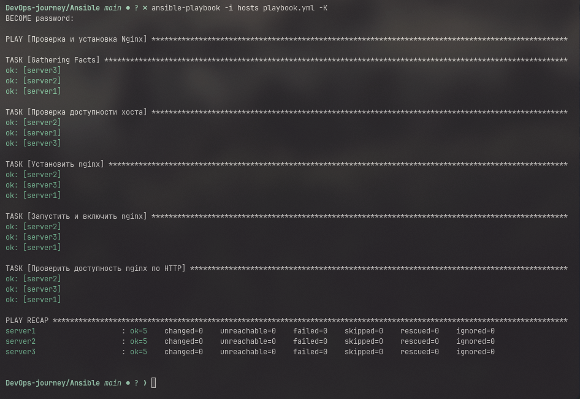
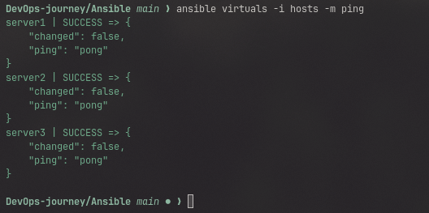

# Ansible

- for ansible practice i use VM's with debian

```
    ansible-playbook playbook.yml -K
```

## что делает наш ansible?

- В файле playbook.yml описаны действия ansible на машине

должно быть что то вроде: 




## Commands:

- fastcheck servers alivness:

```
    ansible virtuals -m ping
```




- copy local file to servers:

```
ansible all -m copy -a "src=file dest=/home mode=777" -b
```

- Start playbook:

```
ansible virtuals playbook.yml -K
```