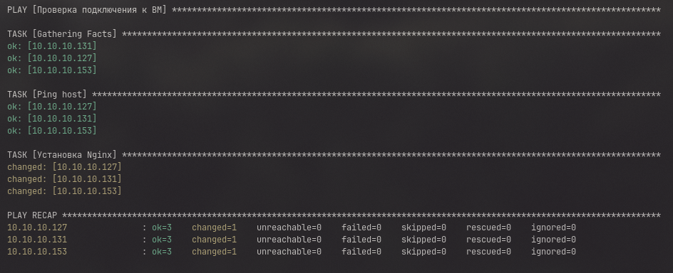

# Ansible

- for ansible practice i use VM's with debian

```
    ansible-playbook -i hosts playbook.yml -K
```

## что делает наш ansible?

- В файле playbook.yml описаны действия ansible на машине

должно быть что то вроде: 

