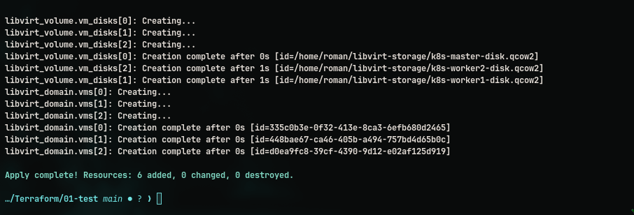

# Terraform IaC

I practice terraform with clouds and libvirt on my server

- for server configuration you need to:
1. Install KVM/Libvirt
2. Install Terraform
3. Practice with terraform 


## terraform commands
```
terraform init
terraform plan -var-file="secrets.tfvars"
terraform apply -var-file="secrets.tfvars"
terraform destroy 
rm -rf .terraform .terraform.lock.hcl
```

## libvirt commands

Быстрая очистка для tf:
```
# Полная очистка перед новым terraform apply
virsh destroy k8s-master 2>/dev/null
virsh destroy k8s-worker1 2>/dev/null
virsh destroy k8s-worker2 2>/dev/null
virsh undefine k8s-master --remove-all-storage 2>/dev/null
virsh undefine k8s-worker1 --remove-all-storage 2>/dev/null
virsh undefine k8s-worker2 --remove-all-storage 2>/dev/null

# Проверить что всё удалено
virsh list --all
virsh vol-list default
```


```
# Список всех VM (работающих и выключенных)
virsh list --all

# Список только работающих VM
virsh list

# Детальная информация о VM
virsh dominfo k8s-master

# Показать XML конфигурацию VM
virsh dumpxml k8s-master

# Запустить VM
virsh start k8s-master

# Выключить VM (graceful shutdown)
virsh shutdown k8s-master

# Принудительно остановить VM (как выдернуть шнур)
virsh destroy k8s-master

# Перезагрузить VM
virsh reboot k8s-master

# Приостановить VM
virsh suspend k8s-master

# Возобновить VM
virsh resume k8s-master

# Показать все диски в storage pool
virsh vol-list default

# Удалить конкретный диск
virsh vol-delete --pool default k8s-master-disk.qcow2

# Обновить список дисков в pool
virsh pool-refresh default


Массовое удаление всех VM

# Удалить все VM с префиксом k8s-
for vm in $(virsh list --all --name | grep "k8s-"); do
    virsh destroy $vm 2>/dev/null
    virsh undefine $vm --remove-all-storage
done

# Или вручную перечислить
for vm in k8s-master k8s-worker1 k8s-worker2; do
    virsh destroy $vm 2>/dev/null
    virsh undefine $vm --remove-all-storage
done


# Список storage pools
virsh pool-list --all

# Информация о pool
virsh pool-info default

# Запустить pool
virsh pool-start default

# Остановить pool
virsh pool-destroy default

# Удалить pool
virsh pool-undefine default
```


FOr RU region :

- Change the path of downloading registry.terraform.io

```
cat > ~/.terraformrc << 'EOF'
provider_installation {
  network_mirror {
    url = "https://terraform-mirror.yandexcloud.net/"
    include = ["registry.terraform.io/*/*"]
  }
  direct {
    exclude = ["registry.terraform.io/*/*"]
  }
}
EOF
```


## Errors 

```
Planning failed. Terraform encountered an error while generating this plan.

╷
│ Error: failed to connect: could not configure SSH authentication methods
│
│   with provider["registry.terraform.io/dmacvicar/libvirt"],
│   on main.tf line 10, in provider "libvirt":
│   10: provider "libvirt" {
│
╵
```

fix: add ssh agent 


## Final result : 



