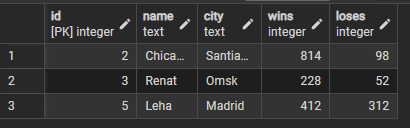

Here is a self-maded lawyers data base 

- Firstly use create_table.sql to create a table, or just copy below


```
CREATE TABLE lawyers (
	id SERIAL PRIMARY KEY,
	name TEXT,
	city TEXT,
	wins INT,
	loses INT
);
INSERT INTO lawyers (name, city, wins, loses) VALUES ('Ronaldo', 'Moscow', 24, 9), ('Chicago', 'Santiago', 814, 98), ('Renat', 'Omsk', 228, 52), ('Misha', 'Omsk', 0, 100), ('Leha', 'Madrid', 412, 312)
```

- Then we will SELECT all the lawyers that wons more than 100 time with select.sql file or just copy below


```
    SELECT * FROM lawyers
    WHERE wins > 100;
```

- It should be something like this.





- But wait, we have a message about Misha's lawyer winning the first case. To add this to the database, we'll use the UPDATE command. You can find it in the update.sql file or below.

```
    Update lawyers
    SET wins = 1
    WHERE name = 'Misha'
```


- Also we have to delete Chicago from our table because he retired, to do so we will use DELETE, u can find sql in delete.sql or below

```
    DELETE FROM lawyers
    WHERE name = 'Chicago';
```


- That's all, hope you enjoy!