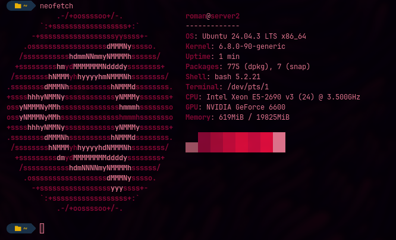

# k8s cluster RKE2

first kubernetes cluster with RKE2.

- dns_nfs.md = DNS and NFS server configuration

## VM's

- debian
- 4GB RAM
- Processors: 4

## DNS and NFS

- Ubuntu
- server with DNS and NFS
- 20GB RAM

