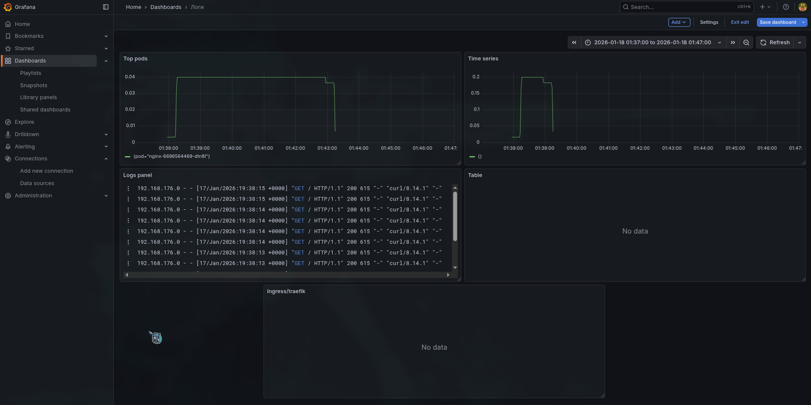

Prometheus PromQL:
```
CPU по pod’ам dev
kube_deployment_status_replicas_available{namespace="dev"}

Memory по pod’ам dev
sum by (pod) (container_memory_working_set_bytes{namespace="dev", container!="POD", image!=""})

Рестарты
sum by (pod) (increase(kube_pod_container_status_restarts_total{namespace="dev"}[15m]))

Статус реплик по deployment
kube_deployment_status_replicas_available{namespace="dev"}
```

Loki :
```
Logs panel
{namespace="dev", app="nginx"}

Time series
sum(rate({namespace="dev", app="nginx"}[1m]))

Top pods
topk(5, sum by (pod) (rate({namespace="dev"}[5m])))

Table
{namespace="dev"} |~ "(?i)error|exception|panic"

Ingress/traefik
{namespace="traefik"} |~ "(?i)error|5[0-9][0-9]|timeout|retries"
```


