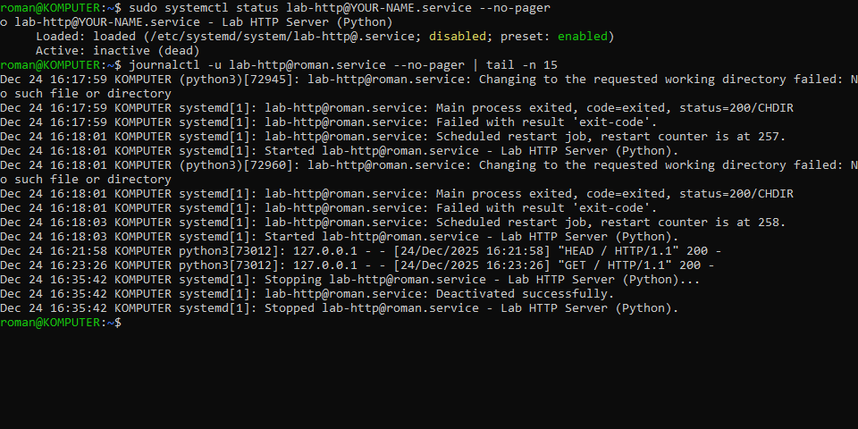
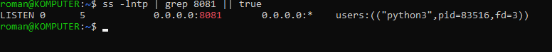
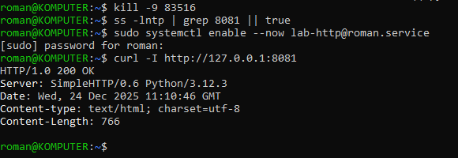

## Симуляция ошибки (Порт занят)

- Для создания ошибки займем порт 8081 командой (перед этим выключите lab-html@.service командой systemctl stop):

```
    python3 -m http.server 8081
```

- После перезапускаем сервис lab-http:

```
    sudo systemctl restart lab-http@YOUR-NAME.service
    sudo systemctl enable --now lab-http@YOUR-NAME.service
    sudo systemctl status lab-http@YOUR-NAME.service --no-pager
    journalctl -u lab-http@roman.service --no-pager | tail -n 15
```





- Находим того кто держит порт командой:

```
    ss -lntp | grep 8081 || true
```





- Выключаем процесс и запускаем наш lab-http:

```
    kill -9 PID
    sudo systemctl enable --now lab-http@YOUR_NAME.service
```


