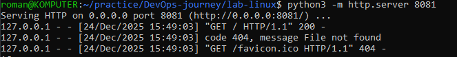
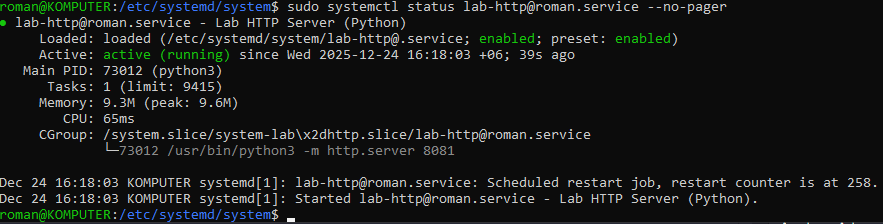
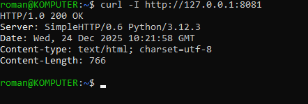
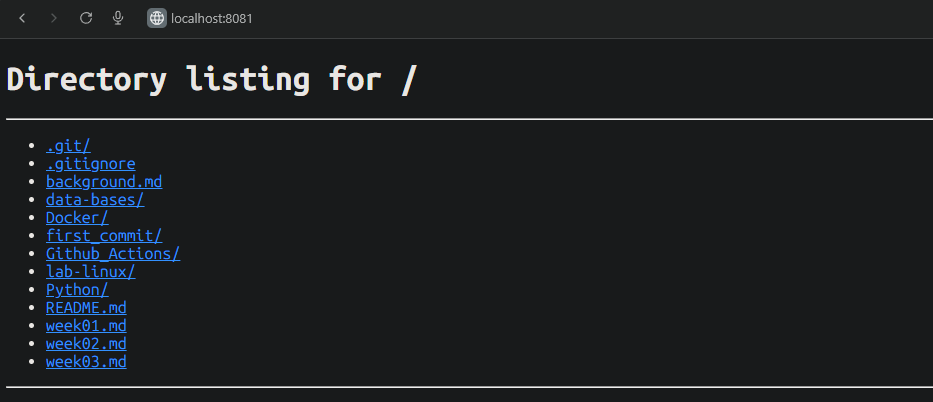

# Practicing linux administration

## to start run:

```
 python3 -m http.server 8081
```

- Then you can check `localhost:8081`:


- In terminal you will see this:





- After that shut down the web and create systemd unit:

```
    sudo nano /etc/systemd/system/lab-http@.service
```

In file:
```
    [Unit]
    Description=Lab HTTP Server (Python)
    After=network.target

    [Service]
    User=%i
    WorkingDirectory=/home/%i/YOUR-DIRECTORY-PATH
    ExecStart=/usr/bin/python3 -m http.server 8081
    Restart=always
    RestartSec=2

    [Install]
    WantedBy=multi-user.target
```

- Then to start :

```
    sudo systemctl daemon-reload
    sudo systemctl enable --now lab-http@YOUR_NAME_USER.service
    systemctl status lab-http@YOUR_NAME_USER.service --no-pager
```

- IF `curl -I http://127.0.0.1:8081` failed, to find a reason why you can use this command below:

```
    journalctl -u lab-http@roman.service -n 20 --no-pager
```

# Trouble with path fix:

```
    sudo nano /etc/systemd/system/lab-http@.service
```

and:

```
    WorkingDirectory=/home/%i/YOUR-CORRECT-DIRECTORY-PATH
```

# Example of correct `systemctl status lab-http@YOUR_NAME_USER.service --no-pager`





- To check web is working type:

```
    curl -I http://127.0.0.1:8081
```

the answer should be: 200 Ok





# Web site example





## All next steps will be in [Error-simulation.md](https://github.com/zamasulolmeme123/DevOps-journey/lab-linux/Erorr-simulation.md)