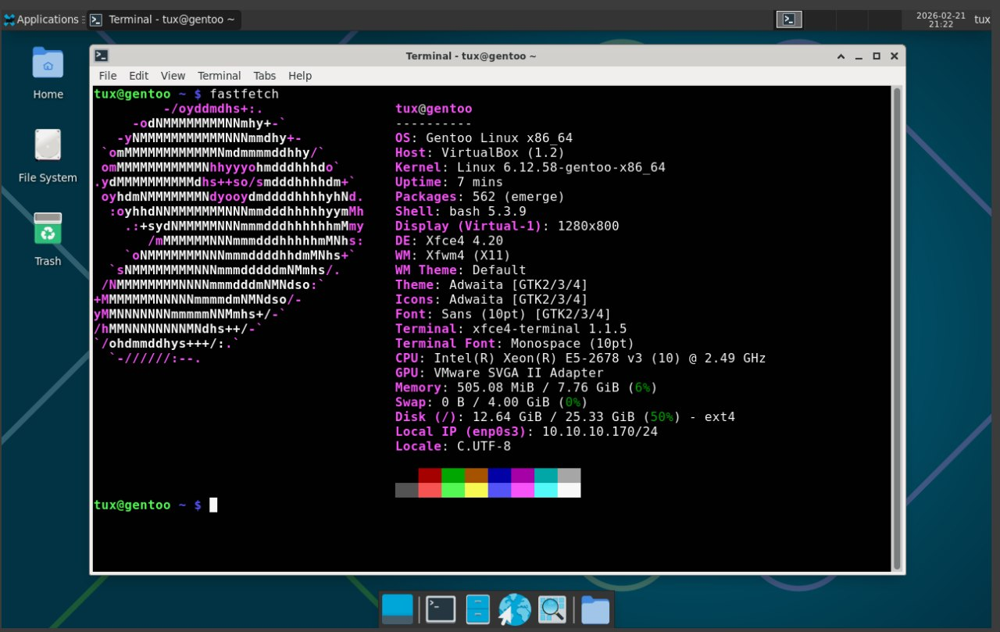

# Week 01

- Linux - (linuxsurvival.com(базовые команды с практическими примерами)) + WSL2 + Работа с виртуальной машиной + сети(cURL, ping, ss/netstat, права доступа)
процессы и потоки, SIGINT, SIGTERM и т.д., Load Average, состояния процессов. Systemctl. Права и пользователи, файловая система, загрузка и инициализация. Ping, curl -I, ss -lntu/p, traceroute, ufw - uncomplicated firewall (работа с портами и доступами). iptables.   

- SSH - Подключение к ВМ из терминала Windows + создание и подключение к репозиторию через SSH

- Bash scripts - basics

- Git (clone, commit, push, branch, merge, PR, .gitignore, gitflow)


# Week 02

- Linux (disks, member, RAM, df, du, lsblk, iotop, free, meminfo)
- Docker (basics commands, compose, volumes, bind mounts)
- Data bases (PostgreSQL, DBeaver, SQL basics, JOIN(LEFT,RIGHT))
- Python practice
- CI (GitHub Actions)
- FastAPI, Worker, Nginx


# Week 03

- CI/CD (GitHub, GitLab CI/CD [GitLab-Repository](https://gitlab.com/zamasulolmeme123/taskurlproject/))
- Monitoring (Graphana + Prometheus a little of Loki)
- Project Task-URL-Platform
- Kubernetes start (kubectl, worker node, master node / control plane)


# Week 04

- lab-linux (some practice with linux administration)
- deep Docker practice from: [Docker](https://www.youtube.com/watch?v=O8N1lvkIjig) you can see it in /Docker/Dockerfile_practice 


# Week 05

- Change OS to Omarchy (arch based)
- Repeat network
- k8s network
- Ansible (playbooks, hosts, default, handlers, ansible.cfg, etc..)
- iptables, netfilter
- K8s deploy understanding (Helm, ArgoCD, CI)


# Week 06

- kubernetes
- terraform beggining 
- practicing network, linux, etc..


# Week 07

- Practicing kubernetes + helm

# Week 08-09 26 January

Kubernetes, helm, databases, ansible, terraform, brokers, CI/CD Gitlab /// Practice

```
Argo Harbor ELK Vault Yandex Kafka DB replications Jaeger Golang Python Service Mesh Gitlab CI practice
```


# Week 10 3 February

Start looking for a job (firts interviews), golang, kafka/rabbitmq, redis, mongodb, argo, harbor, nexus, k8s topchik karoche


# 21 February

Interview grind + Gentoo 
Vim, xi816, C, Rust and other low level stuff




# 28 February 2026

Started learning Golang and how to program


# 15 March 2026

Accidentally forgot to back up Obsidian with all my notes. 70+ days of productive notes are in the trash — all because I decided to switch from Omarchy to Void Linux. But now I'm back on Omarchy; it's just better than anything

# 26 March 2026

Preparation intern SRE position:
SRE fundamentals (Google SRE books), troubleshooting SRE, system design SRE,
network deeper (Andrew Tanenbaum, etc), Linux, HTTP/HTTPS, Golang programming,
Algorithms, AI with George Hotz stuff.